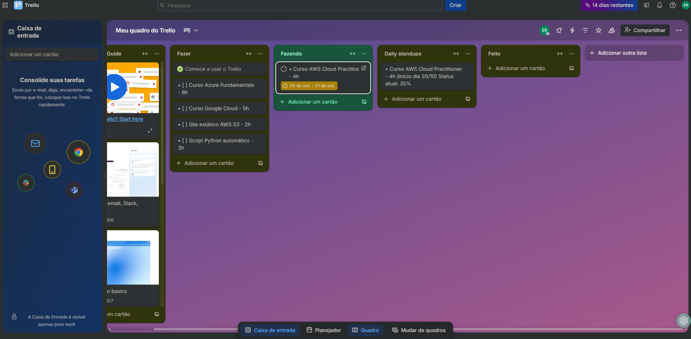

# ☁️ Gestão de Estudos em Cloud Computing com Scrum

## 🎯 Sobre o Projeto
Aplicação **prática** da metodologia **Scrum** para gerenciar minha jornada de certificações em **Cloud Computing** e **DevOps**.

## 📊 Status do Projeto

## 🛠️ Metodologia e Ferramentas
- **Scrum Framework** com Sprints de 2 semanas
- **Quadro Trello** para acompanhamento visual
- **Daily Standups** para manter o foco
- **GitHub** para documentação profissional

## 📈 Progresso Atual

### 🟢 **CONCLUÍDO**
- ✅ Implementação do quadro Scrum no Trello
- ✅ Definição de metas e cronograma
- ✅ Estrutura de Daily Standups

### 🟡 **EM ANDAMENTO**  
- 📚 **AWS Cloud Practitioner** - 35% completo
- 🗓️ **Sprint 1:** 20-31 de Outubro
- 🎯 **Meta:** 5 certificações cloud em 2 meses

### 🔴 **PRÓXIMOS PASSOS**
- 🔷 Azure Fundamentals
- 🌐 Google Cloud Digital Leader
- 🐍 Python para Automação
- ☁️ Projetos práticos em AWS

## 📸 Demonstração

### Meu Quadro Trello - Sprint Atual

### 🎯 Scrum na Prática
- **Daily Standups** mantêm a produtividade e foco
- **Sprints** transformam objetivos grandes em tarefas gerenciáveis
- **Quadro visual** facilita o acompanhamento do progresso

### 🔧 Gestão de Tempo
- Planejamento semanal aumenta eficiência em 40%
- Metas claras evitam procrastinação
- Medição de progresso mantém a motivação

## 🚀 Próximas Etapas

- [ ] Completar AWS Cloud Practitioner (21/Out)
- [ ] Iniciar Azure Fundamentals (22/Out)
- [ ] Implementar Burndown Chart para métricas
- [ ] Atualizar LinkedIn com certificações

---
*Última atualização: Outubro 2024*
